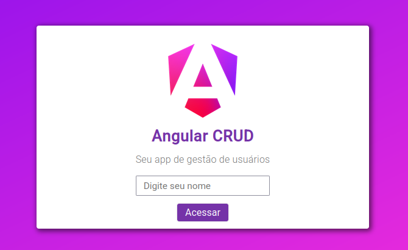
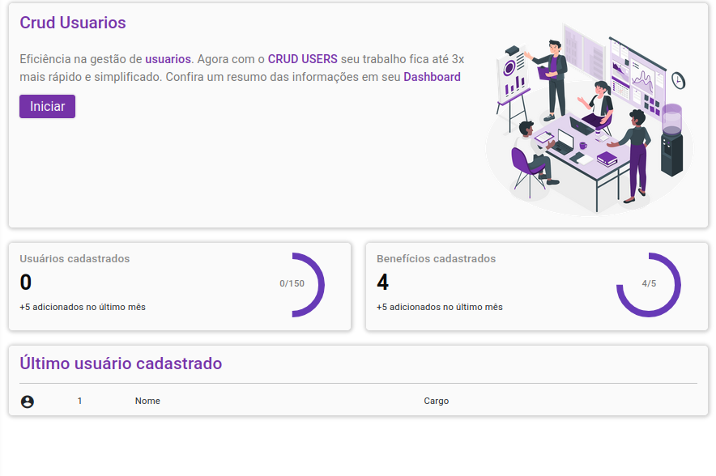
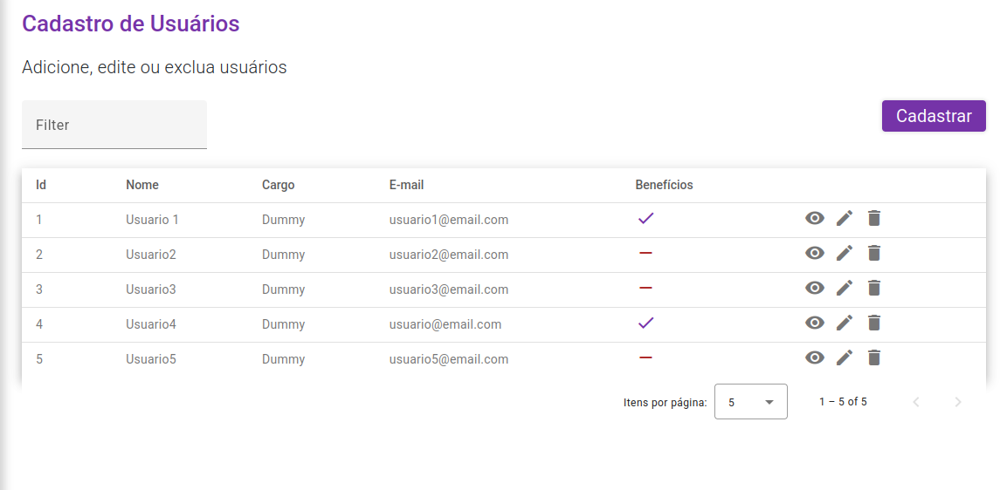

# Crud de usuários em Angular v17

Este projeto é um **CRUD de usuários** desenvolvido com o framework [Angular](https://angular.dev) versão 17, que utiliza o **Firebase Realtime Database** como back-end e **Bootstrap** juntamente com **Angular Material** para construir sua interface. Simula as quatro operações básicas de um sistema de gerenciamento de usuários: **criação, visualização, edição e exclusão**.

---

## 🖼️ Prévia

<div align="center">
    
</div>




## 📖 Sobre o Projeto

Este projeto foi desenvolvido com o intuito de demonstrar habilidades em:

- Criação de projetos Angualar modernos
- Integração com **Firebase**
- Uso de **Angular Material UI** para criação de componentes responsivos
- Aplicações do tipo CRUD completas.

## ⚙️ Rodando o Projeto

> **Atenção**: você precisará configurar o Firebase manualmente para rodar este projeto.

### 1. Clone este repositório localmente:
```bash
git clone https://github.com/AspetereCoder/CRUD-Angular.git
cd CRUD-Angular
```

### 2. Instale as dependências:
```bash
npm install
```

### 3. Configure o Firebase

1. Acesse o [Firebase Console](https://console.firebase.google.com/).
2. Crie um novo projeto.
3. Vá em "Criação" e crie um "Realtime Database".
4. Vá em "Configurações do Projeto" > "Geral" > "Seus aplicativos" e crie um novo app a partir do npm.
5. Copie os dados de configuração do seu "firebaseConfig"
6. Crie uma coleção chamada ``users``
7. Vá no arquivo `src/environments/environment.example.ts` e preencha os dados no campo "firebaseConfig".
8. Renomeie o arquivo `environment.example.ts` para `environment.development.ts`.

### 4. Inicie a aplicação
No diretório do projeto, rode o comando: ``ng serve`` E acesse no navegador a url: ``http://localhost:4200``

## ⚒️ Tecnologias utilizadas

- Angular 17
- Bootstrap
- Angular Material UI
- Firebase Realtime Database
- TypeScript
- RxJS
- Scss

## 💡 Funcionalidades
- ✅ Listagem de usuários
- ✅ Criação de usuários
- ✅ Edição dos dados de usuários existentes
- ✅ Exclusão de Usuários
- ✅ Gerenciamento de benefícios de usuários

## 📄 Licença
Este projeto está licenciado sob a licença MIT. Para mais informações acesse o arquivo [LICENSE](LICENSE)